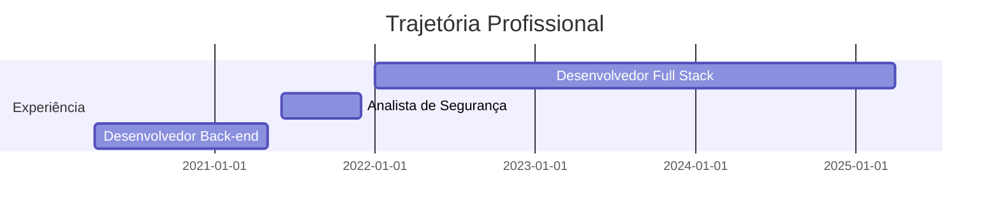

## 👨‍💻 Sobre Mim

Desenvolvedor Full Stack com formação em Engenharia da Computação, especializado em desenvolvimento de software e segurança da informação. Possuo sólidos conhecimentos em arquitetura de software, desenvolvimento orientado a testes e práticas de DevOps. Busco constantemente aprimorar minhas habilidades técnicas e acompanhar as tendências do mercado de tecnologia.

- 🔭 Atualmente trabalho com desenvolvimento de aplicações web e APIs RESTful
- 🌱 Aperfeiçoando conhecimentos em arquitetura de microsserviços e CI/CD
- 🔒 Estudando cibersegurança e pentest para implementação de sistemas seguros
- 🌍 Baseado na região de Campinas, São Paulo - disponível para trabalho remoto
- 💡 Interessado em projetos inovadores com foco em qualidade e boas práticas
- 🎹 Nas horas vagas: músico (teclado/contrabaixo) e gamer

## 🛠️ Competências Técnicas

### Linguagens de Programação

### Frameworks & Bibliotecas

### Banco de Dados

### DevOps & Ferramentas

### Testes & Qualidade

## 🚀 Projetos em Destaque

### [API PDV](https://github.com/marcopezzote/api-pdv-port)
API RESTful para um sistema de Ponto de Venda (PDV) completo que gerencia usuários, produtos, clientes, pedidos e categorias. Desenvolvida com Node.js, Express e PostgreSQL, esta API inclui autenticação JWT, upload de imagens, validação de dados e documentação Swagger.
<!-- 
### [Task Management API](https://github.com/marcopezzote/task-management-api)
API RESTful para gerenciamento de tarefas com funcionalidades específicas para auxiliar pessoas com TDAH. Desenvolvida com Node.js, Express e MongoDB, implementando autenticação JWT e testes unitários automatizados.
-->
### [Secure Auth System](https://github.com/marcopezzote/secure-auth)
Solução de autenticação e autorização robusta e escalável desenvolvida em ASP.NET Core 8. O projeto implementa as melhores práticas de segurança para aplicações modernas, incluindo autenticação multi-fator, gestão avançada de tokens JWT, mecanismos de proteção contra ataques de força bruta e um sistema detalhado de auditoria de segurança.

Desenvolvido com foco em segurança, escalabilidade e manutenibilidade, o SecureAuth fornece uma base sólida para aplicações empresariais que necessitam de um sistema de identidade completo e seguro.

### [Snake Game em Python](https://github.com/marcopezzote/snake-game)
Este é um jogo Snake (Jogo da Cobra) moderno e profissional desenvolvido em Python utilizando a biblioteca Pygame. O projeto demonstra conceitos avançados de programação, incluindo orientação a objetos, gerenciamento de estados, e técnicas de game design.

### [Jogo de Ping-Pong](https://github.com/marcopezzote/ping-pong-html)
Este é um jogo de Ping Pong moderno desenvolvido com HTML5, CSS3 e JavaScript puro. O jogo foi desenvolvido para demonstrar boas práticas de desenvolvimento web, incluindo design responsivo, organização de código e experiência de usuário aprimorada.
<!-- 
### [DevOps Automation Toolkit](https://github.com/marcopezzote/devops-toolkit)
Conjunto de ferramentas para automação de processos de CI/CD, monitoramento e configuração de infraestrutura como código. Utiliza Docker, Kubernetes e scripts em Python para orquestração de ambientes.
-->

## 📊 GitHub Analytics

  

## 💼 Experiência Profissional

## 🎓 Formação Acadêmica

- **Engenharia da Computação** - UNIVESP - Univ. Pública de São Paulo
- **Desenvolvimento Full Stack** - Cubos Academy
- **Certificação em Desenvolvimento Seguro** - Instituto Matera
- **Especialização em DevOps** - Em andamento

  

 

---

  
  
  

 

Obrigado por visitar meu perfil! Vamos nos conectar! 💻

